# armor_detector

订阅相机参数及图像流进行装甲板的识别并解算三维位置，输出识别到的装甲板在输入frame下的三维位置 (一般是以相机光心为原点的相机坐标系)

## fyt::ArmorDetectorNode

装甲板识别节点

### 发布话题 

*  `armor_detector/armors` (`rm_interfaces/msg/Armors`) - 识别到的装甲板信息
*  `armor_detector/debug_lights` (`rm_interfaces/msg/DebugLights`) - Debug灯条信息
*  `armor_detector/debug_armors` (`rm_interfaces/msg/DebugArmors`) - Debug装甲板信息
*  `armor_detector/result_img` (`sensor_msgs/msg/Image`) - 识别结果可视化图像
*  `armor_detector/binary_img` (`sensor_msgs/msg/Image`) - 二值化图像
*  `armor_detector/number_img` (`sensor_msgs/msg/Image`) - 数字识别roi
  
### 订阅话题

*  `image_raw` (`sensor_msgs/msg/Image`) - 相机图像
*  `camera_info` (`sensor_msgs/msg/CameraInfo`) - 相机参数

### 服务

*  `armor_detector/set_mode` (`rm_interfaces/srv/SetMode`) - 设置模式
  
### 参数 

* `debug` (`bool`, default: false) - 是否开启调试模式
* `classify_threshold` (`double`, default: 0.8) - 数字分类阈值
* `ignore_class` (`vector<string>`, default: ["negativie"]) - 跳过的类别
* `binary_thres` (`int`, default: 100) - 二值化阈值
* `light.min_ratio` (`double`, default: 0.08) - 灯条最小长宽比
* `light.max_ratio` (`double`, default: 0.4) - 灯条最大长宽比
* `light.max_angle` (`double`, default: 40) - 灯条最大倾斜角度
* `light.color_diff_thresh` (`int`, default: 25) - 灯条颜色差异阈值`
* `armor.min_light_ratio` (`double`, default: 0.6) - 装甲板最小长宽比
* `armor.min_small_center_distance` (`double`, default: 0.8) - 小装甲板最小中心距离长宽比
* `armor.max_small_center_distance` (`double`, default: 3.2) - 小装甲板最大中心距离长宽比
* `armor.min_large_center_distance` (`double`, default: 1.8) - 大装甲板最小中心距离长宽比
* `armor.max_large_center_distance` (`double`, default: 6.4) - 大装甲板最大中心距离长宽比
* `armor.max_angle` (`double`, default: 35.0) - 装甲板最大倾斜角度

## Detector
装甲板识别器

### preprocessImage
预处理

| 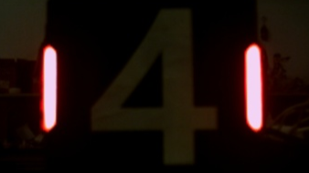 | 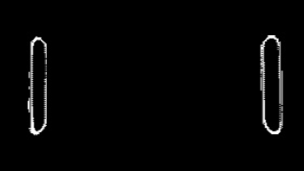 |  |
| :---------------: | :-------------------: | :--------------------: |
|       原图        |    通过颜色二值化     |     通过灰度二值化     |

由于一般工业相机的动态范围不够大，导致若要能够清晰分辨装甲板的数字，得到的相机图像中灯条中心就会过曝，灯条中心的像素点的值往往都是 R=B。根据颜色信息来进行二值化效果不佳，因此此处选择了直接通过灰度图进行二值化，将灯条的颜色判断放到后续处理中。

### findLights
寻找灯条

通过 findContours 得到轮廓，再通过 minAreaRect 获得最小外接矩形，对其进行长宽比和倾斜角度的判断，可以高效的筛除形状不满足的亮斑。

判断灯条颜色这里采用了对轮廓内的的R/B值求和，判断两和的的大小的方法，若 `sum_r > sum_b` 则认为是红色灯条，反之则认为是蓝色灯条。

| 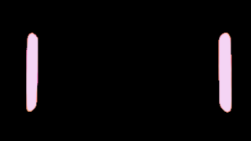 | 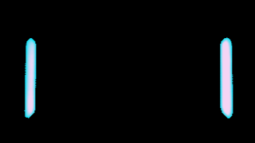 |
| :---------------: | :----------------: |
| 提取出的红色灯条  |  提取出的蓝色灯条  |

### matchLights
配对灯条

根据 `detect_color` 选择对应颜色的灯条进行两两配对，首先筛除掉两条灯条中间包含另一个灯条的情况，然后根据两灯条的长度之比、两灯条中心的距离、配对出装甲板的倾斜角度来筛选掉条件不满足的结果，得到形状符合装甲板特征的灯条配对。

## NumberClassifier
数字分类器

### extractNumbers
提取数字

| 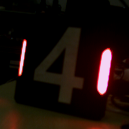 |  | 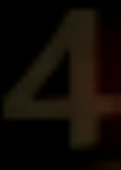 |  |
| :-------------------: | :--------------------: | :-------------------: | :-------------------: |
|         原图          |        透视变换        |         取ROI         |        二值化         |

将每条灯条上下的角点拉伸到装甲板的上下边缘作为待变换点，进行透视变换，再对变换后的图像取ROI。考虑到数字图案实质上就是黑色背景+白色图案，所以此处使用了大津法进行二值化。

### Classify
分类

我们使用LeNet-5网络结构进行数字分类，同时在训练过程中加入了大量的椒盐噪声，有利于提高暗环境下的识别准确率

网络结构：

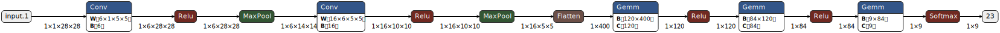

效果图：

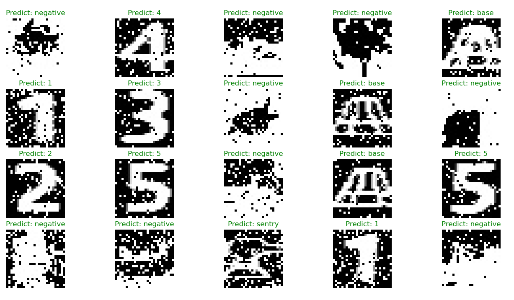

## 角点矫正

在原版rm_vision中，使用旋转矩形的上顶点作为灯条角点，这种方法很受二值化图像的影响，当给不同的二值化阈值或者环境光照不均匀时，识别到的角点位置会发生变化，如图旋转矩形顶点1和2。这会导致角点实际坐标与types.hpp中定义的物体坐标不对应，影响到PnP的准确性。

| 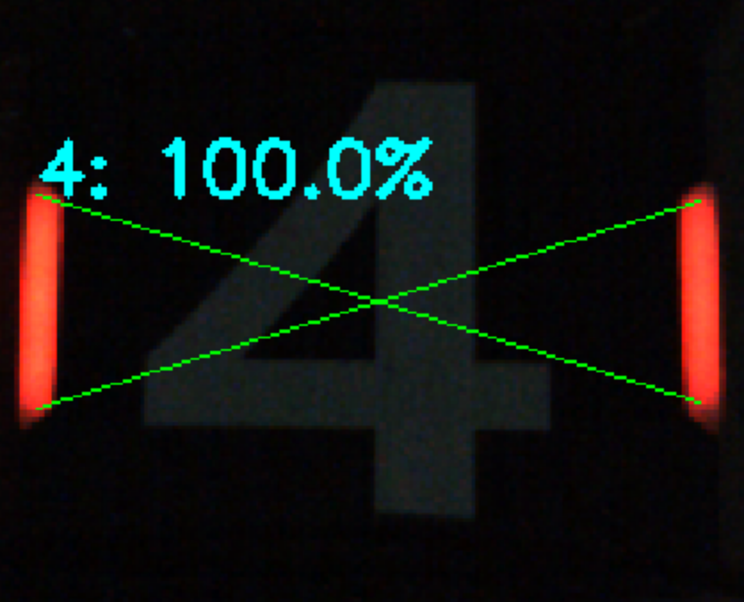 | 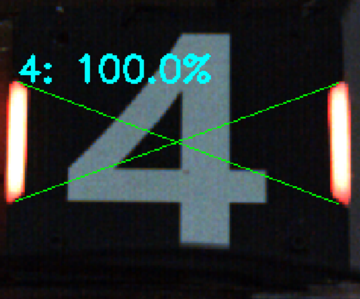 | 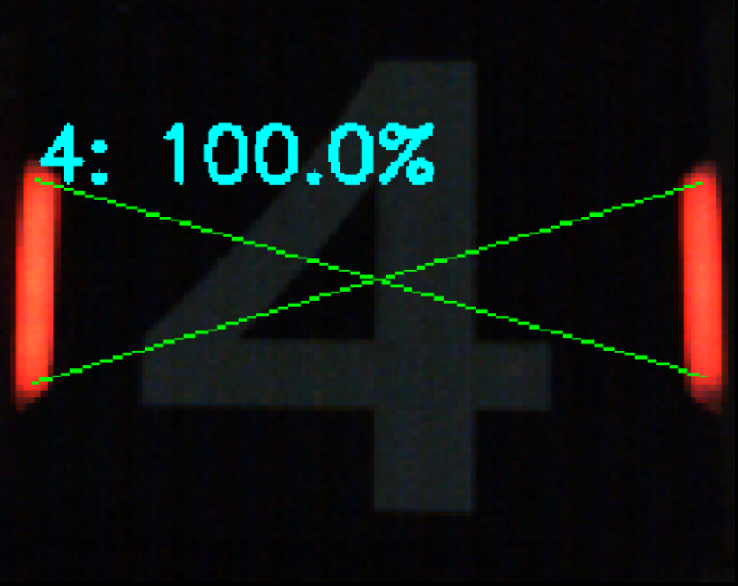 | 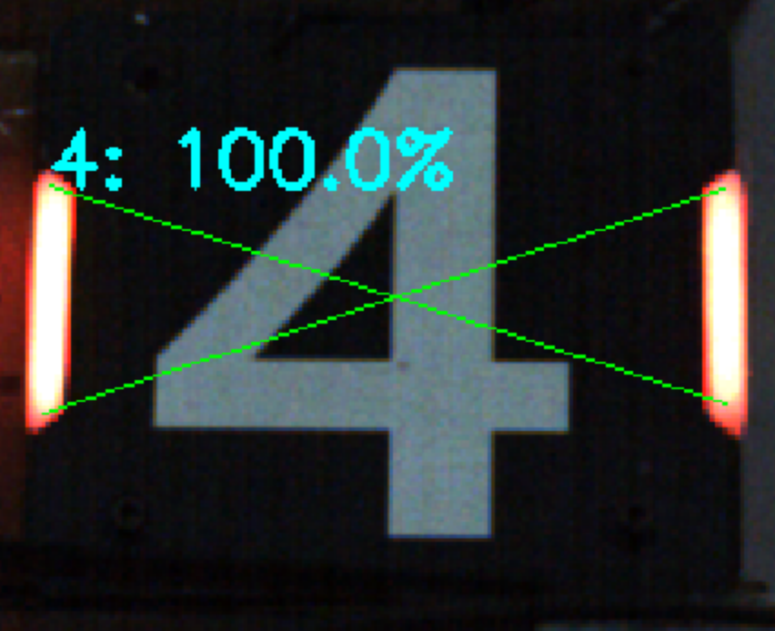 |
| :-------------------: | :--------------------: | :-------------------: | :-------------------: |
|         旋转矩形顶点1          |       旋转矩形顶点2        |         PCA1         |        PCA2         |

为了解决这个问题，我们使用PCA方法对灯条的角点进行矫正，先利用[主成分分析](https://docs.opencv.org/4.x/d1/dee/tutorial_introduction_to_pca.html)(Principal Component Analysis, PCA)方法获取灯条的对称轴，然后根据沿着对称轴方向寻找上下两个亮度梯度变化最大的点（通常是图PCA2中那样的明暗交界处），作为灯条的角点。

如图PCA1和PCA2所示，这种方法获得的角点在不同光照下表现出一致性，可以提高PnP的准确性。

## BA优化

TODO