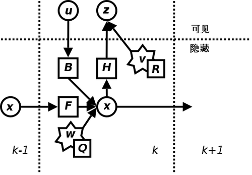

# armor_solver

## fyt::ArmorSolverNode

装甲板识别节点

### 发布话题 

* `armor_solver/target` (`rm_interfaces/msg/Target`) - 整车估计的状态
* `armor_solver/measurement` (`rm_interfaces/msg/Measurement`) - EKF的输入观测量
* `armor_solver/cmd_gimbal` (`rm_interfaces/msg/GimbalCmd`) - 云台控制指令

### 订阅话题

*  `armor_detector/armors` (`rm_interfaces/msg/Armors`) - 识别到的装甲板信息

  
### 参数 

* `debug` (`bool`, default: false) - 是否开启调试模式
* `target_frame` (`string`, default: "odom") - 目标坐标系
* `ekf.sigma2_q_xyz` (`double`, default: 0.05) - 状态转移噪声方差 (x,y,z)
* `ekf.sigma2_q_yaw` (`double`, default: 1.0) - 状态转移噪声方差 (yaw)
* `ekf.sigma2_q_r` (`double`, default: 80.0) - 状态转移噪声方差 (r)
* `r_xyz_factor` (`double`, default: 1.0) - 位置观测噪声方差系数 (x,y,z)
* `r_yaw_factor` (`double`, default: 1.0) - 位置观测噪声方差系数 (yaw)
* `tracker.max_match_distance` (`double`, default: 0.5) - 两帧间目标可匹配的最大距离
* `tracker.max_match_yaw_diff` (`double`, default: 0.5) - 两帧间目标同一块装甲板可匹配的最大yaw角差（大于这个值则认为装甲板发生跳变）
* `tracker.tracking_thres` (`int`, default: 2) - `DETECTING` 状态进入 `TRACKING` 状态需要连续识别到的帧数
* `tracker.lost_thres` (`double`, default: 1.0) - `TRACKING` 状态进入 `LOST` 状态需要连续丢失的时间（s）
* `solver.prediction_delay` (`double`, default: 0.0) - 预测延迟时间（s），会影响选版
* `solver.controller_delay` (`double`, default: 0.0) - 控制延迟时间（s），不会影响选版
* `solver.max_tracking_v_yaw` (`double`, default: 60.0) - 转速大于这个值时，瞄准中心
* `solver.side_angle` (`double`, default: 15.0) - 跳转到下一装甲板的角度阈值
* `solver.bullet_speed` (`double`, default: 25.0) - 子弹速度
* `solver.gravity` (`double`, default: 9.8) - 重力加速度
* `solver.compensator_type` (`string`, default: "ideal") - 补偿器类型
* `solver.resistance` (`double`, default: 0.001) - 空气阻力

## ArmorSolverNode
装甲板处理节点

订阅识别节点发布的装甲板三维位置及机器人的坐标转换信息，将装甲板三维位置变换到指定惯性系（一般是以云台中心为原点，IMU 上电时的 Yaw 朝向为 X 轴的惯性系）下，然后将装甲板目标送入跟踪器中，输出跟踪机器人在指定惯性系下的状态

订阅：
- 已识别到的装甲板 `/detector/armors`
- 机器人的坐标转换信息 `/tf` `/tf_static`

发布：
- 最终锁定的目标 `/tracker/target`

参数：
- 跟踪器参数 tracker
  - 两帧间目标可匹配的最大距离 max_match_distance
  - `DETECTING` 状态进入 `TRACKING` 状态的阈值 tracking_threshold
  - `TRACKING` 状态进入 `LOST` 状态的阈值 lost_threshold

## ExtendedKalmanFilter

$$ x_c = x_a + r * cos (\theta) $$
$$ y_c = y_a + r * sin (\theta) $$

$$ x = [x_c, y_c,z, yaw, v_{xc}, v_{yc},v_z, v_{yaw}, r]^T $$

参考 OpenCV 中的卡尔曼滤波器使用 Eigen 进行了实现

[卡尔曼滤波器](https://zh.wikipedia.org/wiki/%E5%8D%A1%E5%B0%94%E6%9B%BC%E6%BB%A4%E6%B3%A2)

考虑到自瞄任务中对于目标只有观测没有控制，所以输入－控制模型 $B$ 和控制器向量 $u$ 可忽略。

预测及更新的公式如下：

预测：

$$ x_{k|k-1} = F * x_{k-1|k-1} $$

$$ P_{k|k-1} = F * P_{k-1|k-1}* F^T + Q $$

更新:

$$ K = P_{k|k-1} * H^T * (H * P_{k|k-1} * H^T + R)^{-1} $$

$$ x_{k|k} = x_{k|k-1} + K * (z_k - H * x_{k|k-1}) $$

$$ P_{k|k} = (I - K * H) * P_{k|k-1} $$

## Tracker

参考 [SORT(Simple online and realtime tracking)](https://ieeexplore.ieee.org/abstract/document/7533003/) 中对于目标匹配的方法，使用卡尔曼滤波器对单目标在三维空间中进行跟踪

在此跟踪器中，卡尔曼滤波器观测量为目标在指定惯性系中的位置（xyz），状态量为目标位置及速度（xyz+vx vy vz）

在对目标的运动模型建模为在指定惯性系中的匀速线性运动，即状态转移为 $x_{pre} = x_{post} + v_{post} * dt$

目标关联的判断依据为三维位置的 L2 欧式距离

跟踪器共有四个状态：
- `DETECTING` ：短暂识别到目标，需要更多帧识别信息才能进入跟踪状态
- `TRACKING` ：跟踪器正常跟踪目标中
- `TEMP_LOST` ：跟踪器短暂丢失目标，通过卡尔曼滤波器预测目标
- `LOST` ：跟踪器完全丢失目标

工作流程：

- init：

  跟踪器默认选择离相机光心最近的目标作为跟踪对象，选择目标后初始化卡尔曼滤波器，初始状态设为当前目标位置，速度设为 0

- update:

  首先由卡尔曼滤波器得到目标在当前帧的预测位置，然后遍历当前帧中的目标位置与预测位置进行匹配，若当前帧不存在目标或所有目标位置与预测位置的偏差都过大则认为目标丢失，重置卡尔曼滤波器。
  
  最后选取位置相差最小的目标作为最佳匹配项，更新卡尔曼滤波器，将更新后的状态作为跟踪器的结果输出

